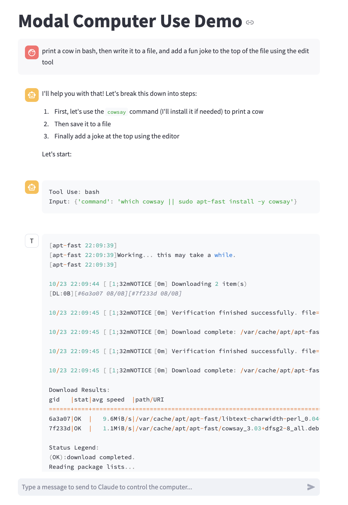

# Anthropic Computer Use on Modal

Anthropic's recent release of [Computer Use](https://anthropic.com/news/3-5-models-and-computer-use) is fantastic, but spinning up random Docker images didn't fit into our production workflow. Luckily, we use [Modal](https://modal.com) and they have all the primitives we need to implement the Computer Use API.

This library provides an out-of-the-box implementation that can be deployed into your Modal environment. Everything runs in a Sandbox, with tool calls being translated into Modal API calls. It may or may not spectacularly explode. It's also quite slow at the moment. Caveat emptor!

## Features

- Deploys into its own app that can be called from your existing apps
- Sandboxes scale to zero and are resumable
- VNC tunnel to each sandbox for debugging
- One NFS per sandbox, available for inspection
- Image processing outside the sandbox, greatly speeding up screenshot generation
- Fuzzy matching for the Edit tool, since the model often misses a newline or two
- Hardware-accelerated browsing in the sandbox
- Pre-warming of the sandbox for faster startup times
- Tools for the LLM to work faster, such as `apt-fast`

## Demo


You can clone this repo and run two demos locally.

### CLI Demo

This demo will deploy an ephemeral Modal app, and ask the LLM to browse the web to fetch the weather in San Francisco.
Screenshots will be shown in your terminal so you can follow along!

```bash
git clone https://github.com/yasyf/anthropic-tool-use-modal
cd anthropic-tool-use-modal
uv sync
modal run computer_use_modal.demo
```

### Streamlit Demo

This demo deploys the app persistently to its own namespace in your Modal account, then starts a Streamlit app that can interact with it.

```bash
git clone https://github.com/yasyf/anthropic-tool-use-modal
cd anthropic-tool-use-modal
uv sync --dev
modal deploy computer_use_modal
python -m streamlit run computer_use_modal/streamlit.py
```



## Installation

You can install this library without cloning the repo by running:

```bash
pip install computer-use-modal
```

To use it in your own project, simply deploy it once:

```bash
modal deploy computer_use_modal
```

Then you can use it in your app like this:

```python
from modal import Cls

server = Cls.lookup("anthropic-computer-use-modal", "ComputerUseServer")
response = server.messages_create.remote.aio(
    request_id=uuid4().hex,
    user_messages=[{"role": "user", "content": "What is the weather in San Francisco?"}],
)
```

```python
{
    'role': 'assistant',
    'content': [
        BetaTextBlock(
            text='According to the National Weather Service, the current weather in San Francisco is:\n\nTemperature: 65°F (18°C)\nHumidity: 53%\nDewpoint: 48°F (9°C)\nLast update: October 23, 2:43 PM
PDT\n\nThe website shows the forecast details as well. Would you like me to provide the extended forecast for the coming days?',
            type='text'
        )
    ]
}
```

You can also watch the progress with a VNC tunnel:

```python
manager = Cls.lookup("anthropic-computer-use-modal", "SandboxManager")
urls = manager.debug_urls.remote()
print(urls["vnc"])
```

## Thanks

Thanks to the Anthropic team for the awesome starting point!
